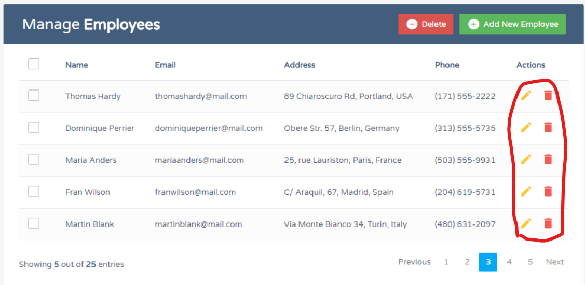
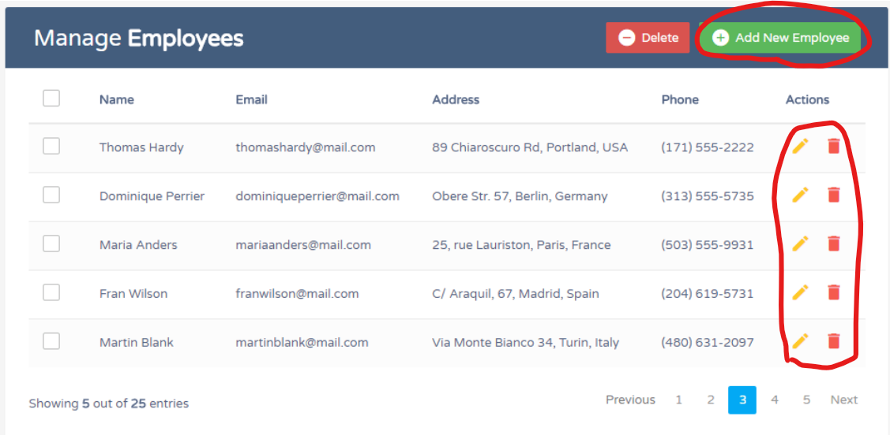
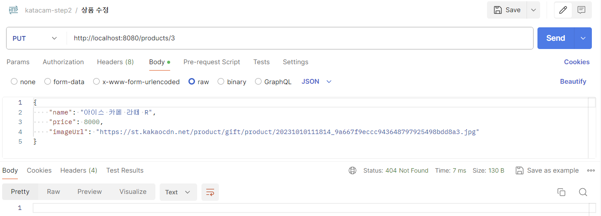

# spring-gift-product
## 1단계 - 상품 API
> 상품을 조회, 추가, 수정, 삭제할 수 있는 HTTP API 구현   
> HTTP 요청과 응답은 JSON 형식   
> 객체 Collections 사용해 메모리에 저장
### 기능 요구사항 목록
- [x] 상품 객체 만들기
- [x] 상품 추가 기능
  
- [x] 상품 조회 기능
  - 전체 상품 조회
    
  - 특정 상품 조회
    
  - 존재하지 않는 상품 조회
    
- [x] 상품 수정 기능
  - 존재하는 상품 수정
    
  - 존재하지 않는 상품 수정
    
- [x] 상품 삭제 기능
  - 존재하는 상품 삭제
    
    &Rightarrow; 조회 결과
    
  - 존재하지 않는 상품 삭제
    