# spring-gift-product
## 1단계 - 상품 API
> 상품을 조회, 추가, 수정, 삭제할 수 있는 HTTP API 구현   
> HTTP 요청과 응답은 JSON 형식   
> 객체 Collections 사용해 메모리에 저장
### 기능 요구사항 목록
- [x] 상품 객체 만들기
- [x] 상품 추가 기능
  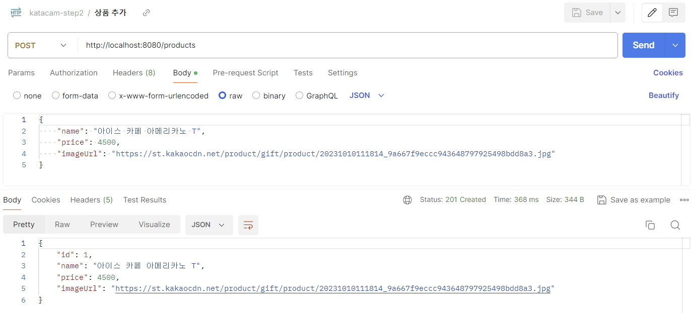
- [x] 상품 조회 기능
  - 전체 상품 조회
    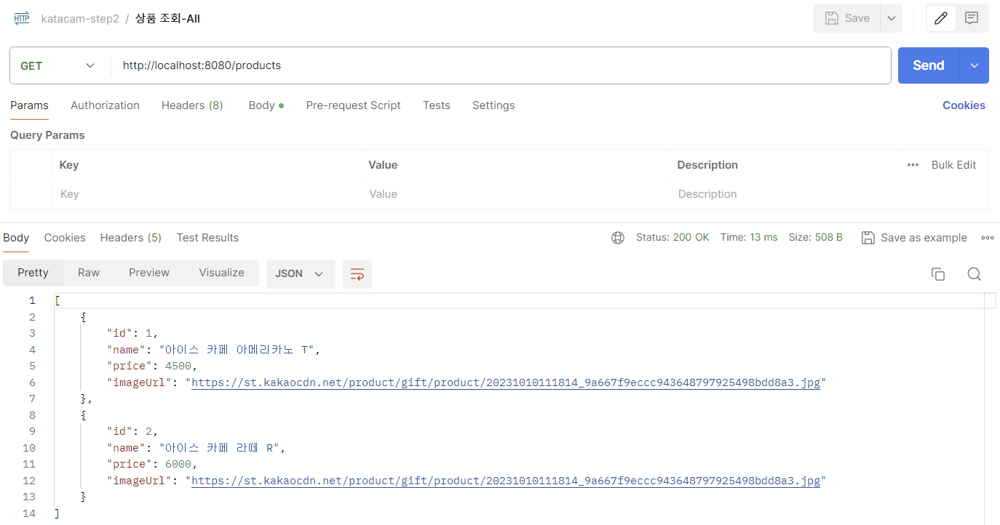
  - 특정 상품 조회
    
  - 존재하지 않는 상품 조회
    
- [x] 상품 수정 기능
  - 존재하는 상품 수정
    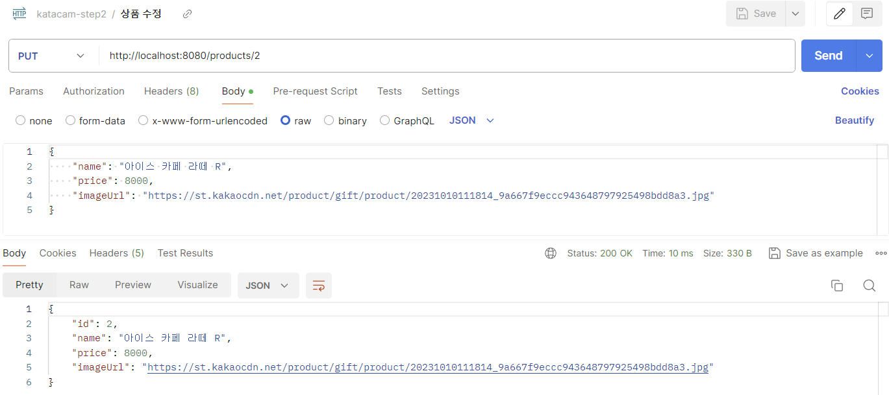
  - 존재하지 않는 상품 수정
    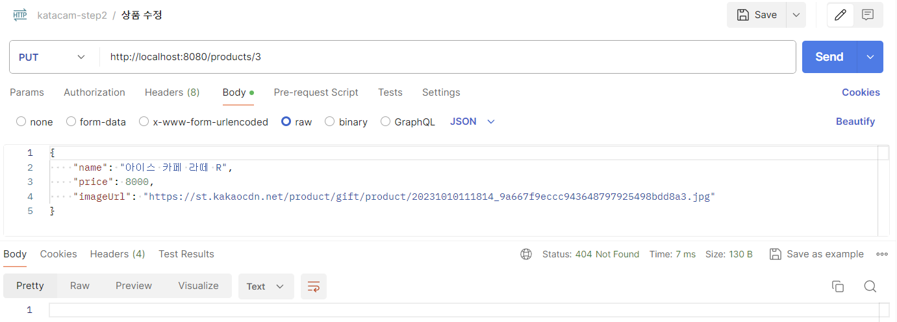
- [x] 상품 삭제 기능
  - 존재하는 상품 삭제
    
    &Rightarrow; 조회 결과
    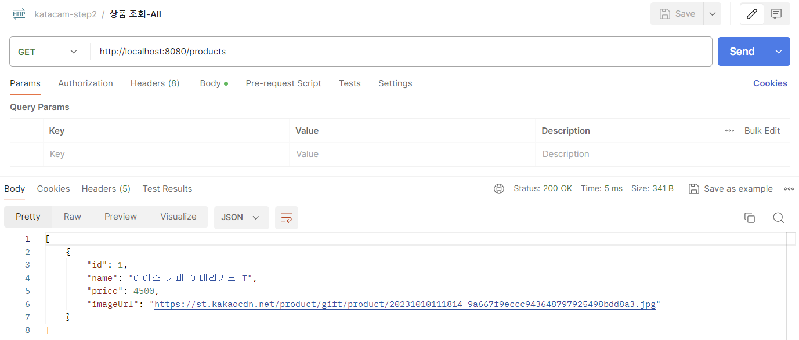
  - 존재하지 않는 상품 삭제
    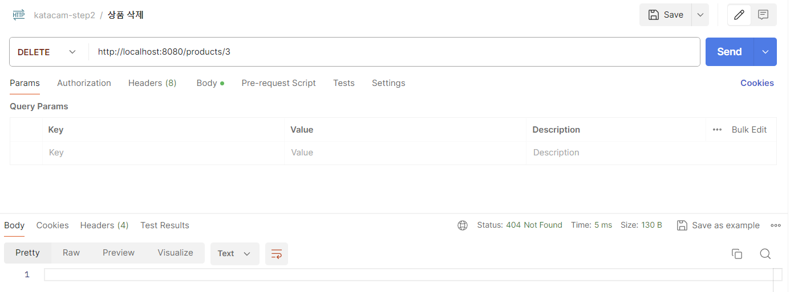

## 2단계 - 관리자 화면
> 상품을 조회, 추가, 수정, 삭제할 수 있는 관리자 화면 구현  
> Thymeleaf를 사용해 서버 사이드 렌더링
### 기능 요구사항 목록
- [x] 전체 상품 조회 페이지 만들기
  - 상품 별 수정, 삭제 버튼
  - 상품 추가 버튼
  
  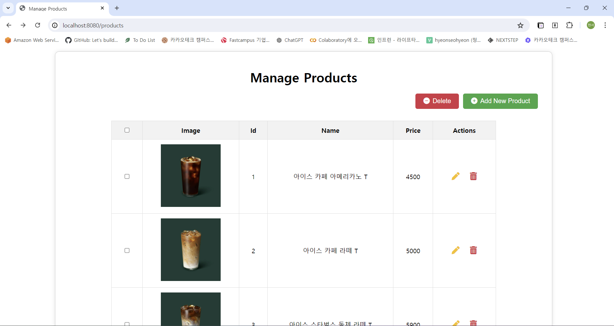
- [x] 특정 상품 조회 페이지 만들기
  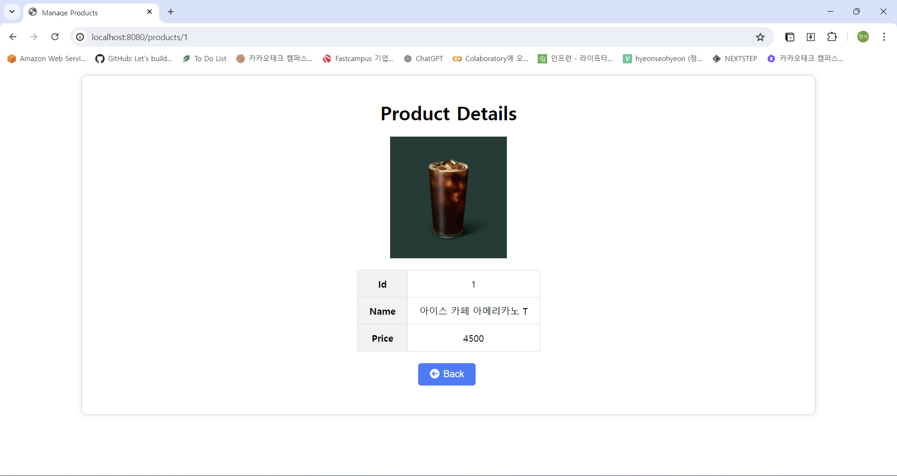
- [x] 상품 추가 페이지 만들기
  - 추가 버튼, 취소 버튼
  
  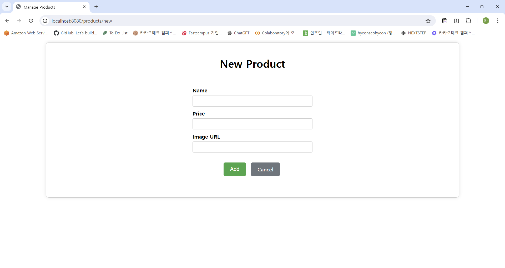
- [x] 상품 수정 페이지 만들기
  - 수정 버튼, 취소 버튼
  
  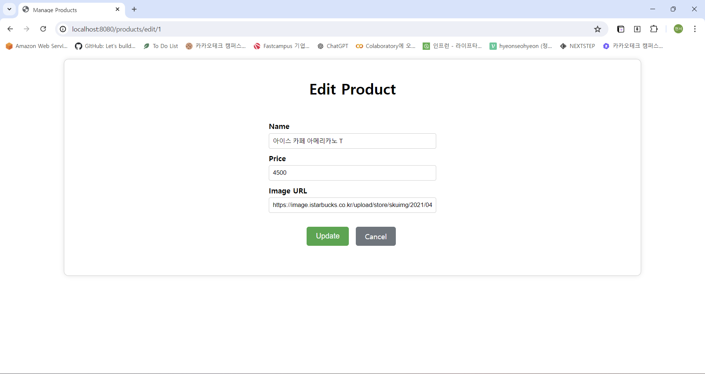
- [x] 상품 추가 버튼 API 연결
  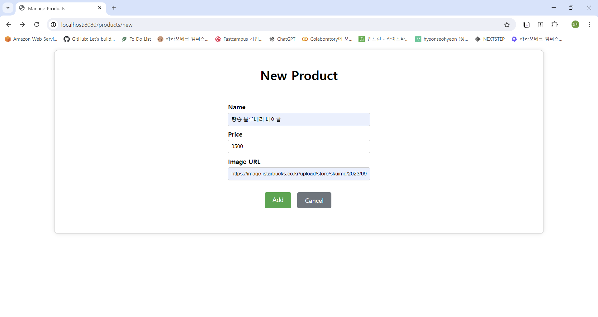
  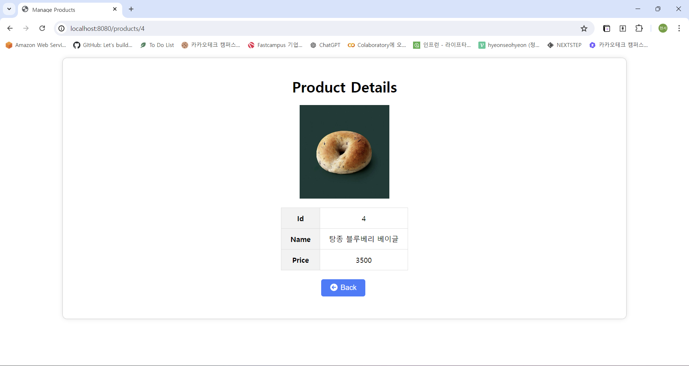
- [ ] 상품 수정 버튼 API 연결
- [ ] 상품 삭제 버튼 API 연결