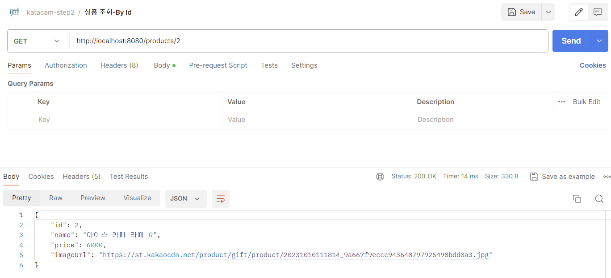
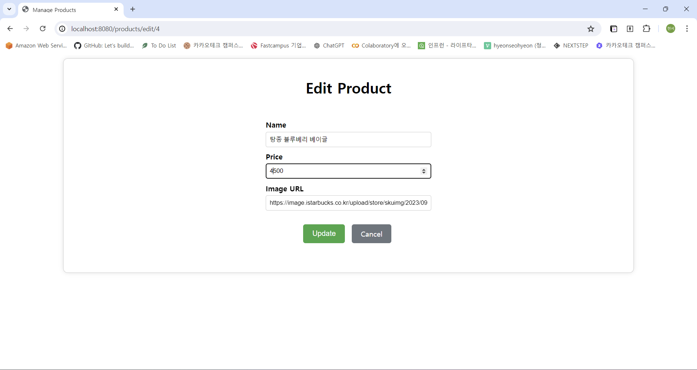
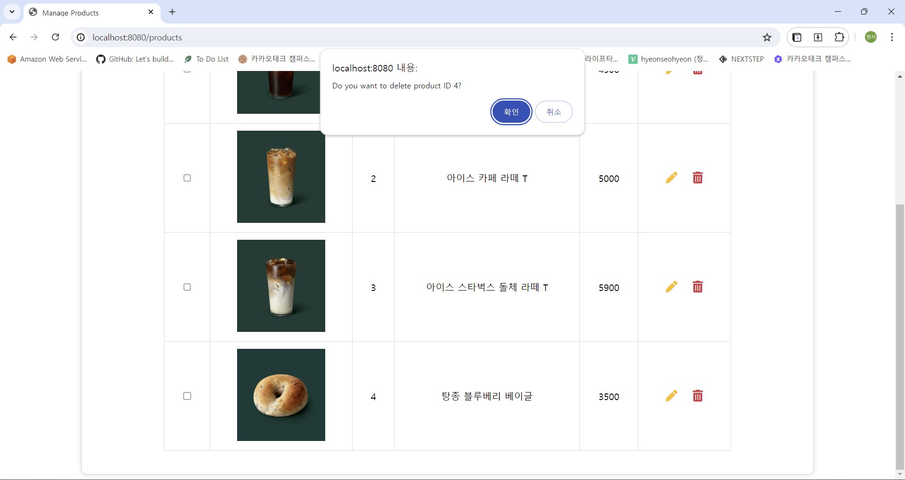
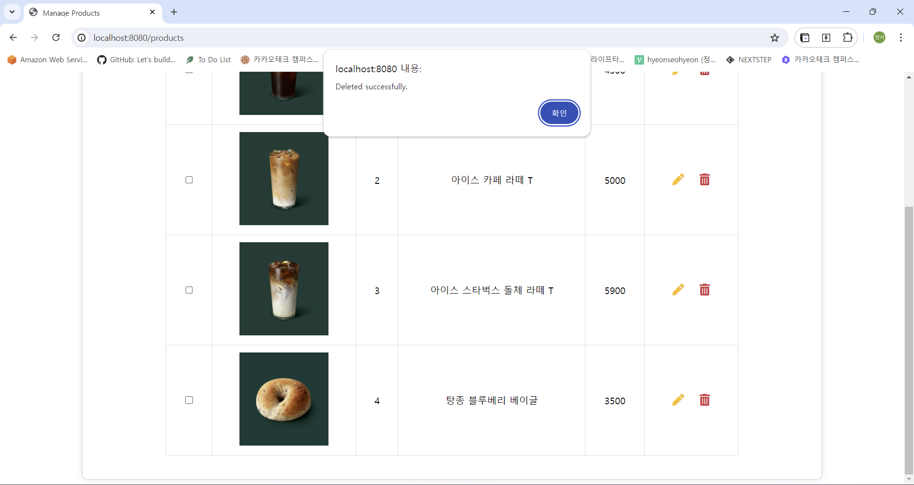
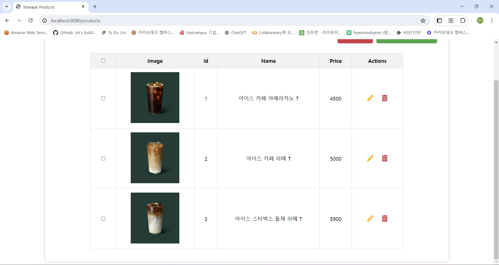

# spring-gift-product
## 1단계 - 상품 API
> 상품을 조회, 추가, 수정, 삭제할 수 있는 HTTP API 구현   
> HTTP 요청과 응답은 JSON 형식   
> 객체 Collections 사용해 메모리에 저장
### 기능 요구사항 목록
- [x] 상품 객체 만들기
- [x] 상품 추가 기능
  
- [x] 상품 조회 기능
  - 전체 상품 조회
    
  - 특정 상품 조회
    
  - 존재하지 않는 상품 조회
    
- [x] 상품 수정 기능
  - 존재하는 상품 수정
    
  - 존재하지 않는 상품 수정
    
- [x] 상품 삭제 기능
  - 존재하는 상품 삭제
    
    &Rightarrow; 조회 결과
    
  - 존재하지 않는 상품 삭제
    

## 2단계 - 관리자 화면
> 상품을 조회, 추가, 수정, 삭제할 수 있는 관리자 화면 구현  
> Thymeleaf를 사용해 서버 사이드 렌더링
### 기능 요구사항 목록
- [x] 전체 상품 조회 페이지 만들기
  - 상품 별 수정, 삭제 버튼
  - 상품 추가 버튼
  
  
- [x] 특정 상품 조회 페이지 만들기
  
- [x] 상품 추가 페이지 만들기
  - 추가 버튼, 취소 버튼
  
  
- [x] 상품 수정 페이지 만들기
  - 수정 버튼, 취소 버튼
  
  
- [x] 상품 추가 버튼 API 연결
  
  
- [x] 상품 수정 버튼 API 연결
  
  
- [x] 상품 삭제 버튼 API 연결
  
  
  
## 3단계 - 데이터베이스 적용
> 상품 정보를 H2 데이터베이스에 저장하도록 변경
> 사용하는 테이블은 애플리케이션 실행 시 구축되어야 함.
### 기능 요구사항 목록
- [x] `schema.sql`, `data.sql` 작성
- [x] 상품 추가 기능 코드 변경
- [x] 상품 조회 기능 코드 변경
- [x] 상품 수정 기능 코드 변경
- [x] 상품 삭제 기능 코드 변경